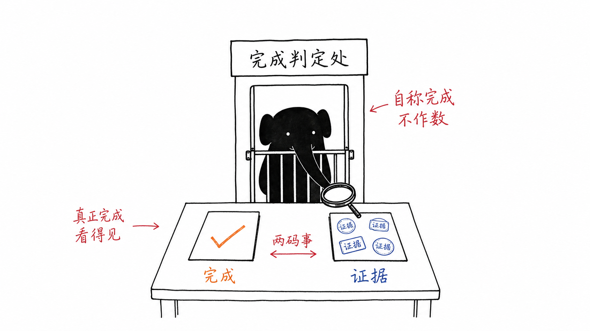
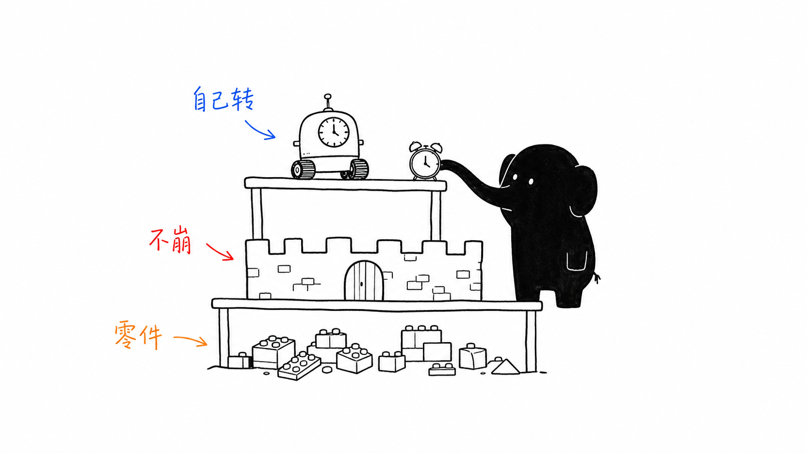
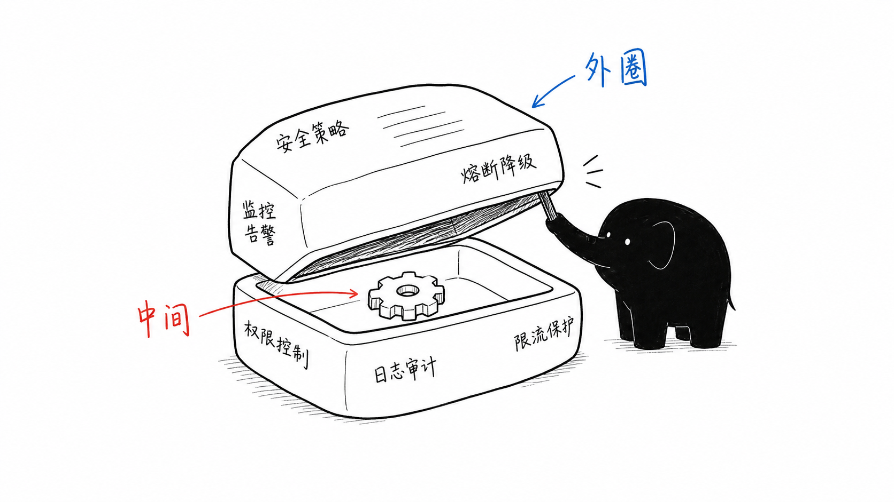
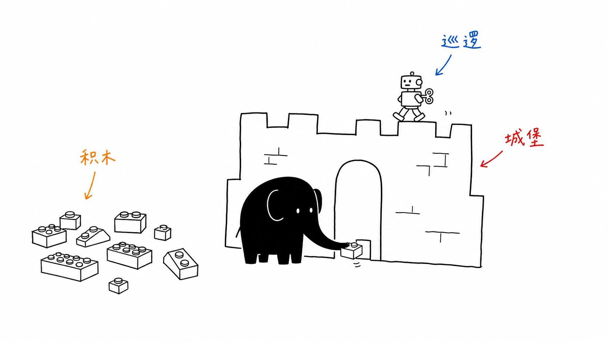
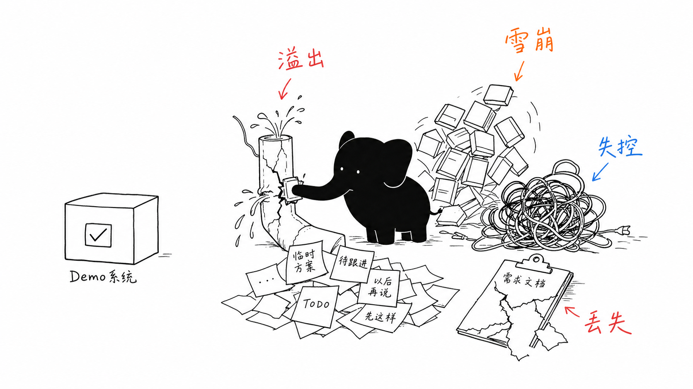
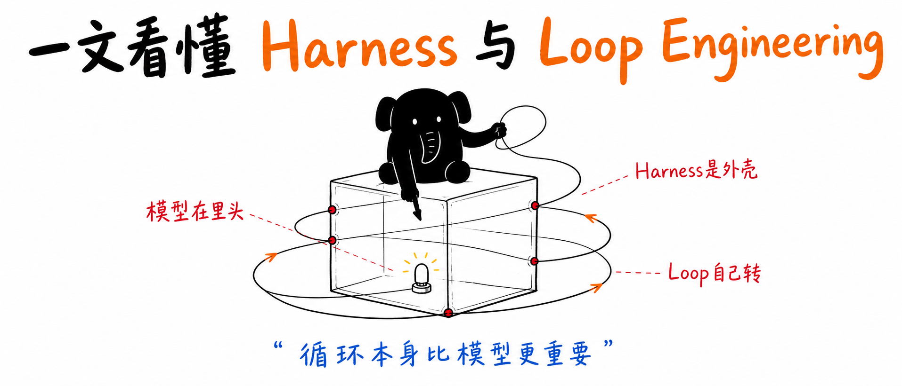

# Xiaohei Elephant Illustrations

> 把中文文章里的学习卡点、流程断点、工具选择和 AI 协作处境，变成一张张白底、手绘、怪诞但清爽的“小黑象”正文配图。
>
> 16:9 横版 | 小黑象 IP | 1.0 白底手绘解释图 | 2.0 真实物品场景图 | Codex / Claude / Hermes Skill

---

## 这个仓库是什么

Xiaohei Elephant Illustrations 是一个面向中文内容创作的 AI 绘图 Skill 包，用来指导 Agent 为公众号文章、中文帖子、AI 工具教程、工作流文档、社群 SOP、课程方法论和项目复盘生成正文配图。

它不是通用插画 prompt，也不是 PPT 信息图模板。它的核心目标是：先理解内容里的认知锚点，再把其中一个判断、流程、状态或隐喻，变成一张有记忆点的 16:9 白底手绘解释图。

默认视觉 IP 是“小黑象”：黑色实心、短象鼻、小耳朵、短腿、白点眼的小象角色。小黑象不是萌宠、表情包或站在角落里的装饰物，而是普通人面对 AI 系统、任务、信息过载和输出验收时的认真执行者。

核心公式：

```text
小黑象 + 认知锚点 + 低科技物理隐喻 + 少量中文批注 + 留白
```

一句话：**让 AI 不只是“配一张图”，而是把文章里的一个关键认知动作画出来。**

---

## 两个版本

| 版本 | Skill | 视觉核心 | 适合内容 |
| --- | --- | --- | --- |
| 1.0 | `xiaohei-elephant-illustrations` | 白底手绘解释图 | 方法论、流程、结构、认知拆解、公众号正文插图 |
| 2.0 | `xiaohei-elephant-scenes` | 真实物品 + 物理动作的小现场 | 处境共鸣、工作压力、AI 工具链崩溃、项目复盘、个人经历、彩蛋长卷 |

1.0 更像在白纸上画出一个认知动作。2.0 更像在白色摄影棚里搭出一个真实物品小现场。

---

## 适合谁用

特别适合：

- 写中文文章，需要正文配图和段落插图的人
- 做 AI 工作流、工具教程、项目复盘、社群 SOP 和课程方法论的人
- 想把“普通人学 AI 的卡点”画成具体隐喻的人
- 想要比 PPT 信息图更轻、更怪、更有个人识别度的配图风格的人
- 用 Codex、Claude Code 或 Hermes 做内容生产，希望稳定复用一套视觉语言的人

不适合：

- 想要商业 KV、品牌海报、精致扁平插画或产品截图的人
- 想要传统流程图、复杂架构图、课程课件或信息图大页的人
- 想要儿童卡通、可爱吉祥物、表情包或写实动物的人
- 想把大量正文、完整教程或多段解释塞进一张图里的人
- 需要严格可编辑矢量源文件的人

---

## 它会产出什么

默认输出：

- 16:9 横版白底手绘正文配图
- 16:9 横版真实物品小现场
- 一篇文章的 4-6 张 shot list，短文 1-3 张，长教程最多 8 张
- 每张图的插入位置、主题、核心意思、构图模式、小黑象动作、关键物件和中文短标签
- 单张概念图 prompt
- 最终 PNG 图片
- 项目复盘 / 个人经历用的小黑象彩蛋长卷
- 终稿确认后的 `06-配图方案.md` 模板

默认不输出：

- PPTX / PDF / Keynote
- SVG / HTML / Canvas 可编辑图
- 商业海报、封面 KV、UI mockup 或产品截图
- 复杂架构图、正式流程图或大段文字型信息图

---

## 视觉风格

这个 Skill 默认使用“小黑象中文正文配图”风格：

- 纯白背景，不要纸纹、米色、阴影、渐变
- 黑色手绘线稿，细线，轻微抖动
- 大量留白，主体通常只占画面约 40%-60%
- 小黑象必须能一眼识别：短象鼻、小耳朵、短腿、白点眼
- 少量红色、蓝色、橙色中文手写批注，通常 1-3 个短词
- 一张图只表达一个核心动作、结构、状态或隐喻
- 小黑象必须参与核心动作，不能只是站在旁边
- 怪诞、有创意、清爽，但不幼稚、不卖萌、不像课程 PPT

2.0 真实物品场景图额外要求：

- 纯白或接近纯白摄影棚背景
- 一个真实主物品或紧凑物品组
- 小黑象和真实物品发生推、拉、挡、托、盖章、检查、修补等物理动作
- 真实物品有自然光影，但不能像商品摄影或素材堆

---

## 实际效果

下面这些图来自脱敏示例项目，用来展示不同类型的小黑象正文配图。它们是风格校准样例，不是固定构图模板；使用时应该从当前文章重新发明隐喻。

### 完成判定处



适合表达：AI 输出不能只靠“自称完成”，必须进入可见的验收和证据检查。

### 自转与零件



适合表达：系统能自己转起来，但底层零件、约束和运行边界仍然要有人设计。

### 安全外壳



适合表达：真正可用的 AI 工作流，需要权限控制、日志审计、限流保护和熔断降级。

### 积木城堡



适合表达：复杂系统不是一次搭完，而是一块一块搭出可测试、可替换的结构。

### 四类崩溃



适合表达：工具链、需求、文档和执行过程同时失控时，问题不是模型本身，而是工程系统没有兜住。

### 封面示例



适合表达：文章封面或章节视觉锚点，帮助读者先建立主题印象。

更多示例素材见：

- [examples/harness-loop-engineering/shot-list.md](examples/harness-loop-engineering/shot-list.md)
- [examples/harness-loop-engineering/prompts/cover-prompt.md](examples/harness-loop-engineering/prompts/cover-prompt.md)

---

## 安装

克隆仓库：

```bash
git clone https://github.com/daxiangnaoyang/xiaohei-elephant-illustrations.git
cd xiaohei-elephant-illustrations
```

复制或软链接 1.0 Skill 到 Codex skills 目录：

```bash
mkdir -p "${CODEX_HOME:-$HOME/.codex}/skills"
ln -s "$(pwd)/skill/xiaohei-elephant-illustrations" "${CODEX_HOME:-$HOME/.codex}/skills/xiaohei-elephant-illustrations"
```

复制或软链接 2.0 Skill：

```bash
ln -s "$(pwd)/skill/xiaohei-elephant-scenes" "${CODEX_HOME:-$HOME/.codex}/skills/xiaohei-elephant-scenes"
```

如果你使用的是 Hermes / Claude Code 运行时，把目标目录替换成对应的 Skill root。

真正需要安装到 Agent 运行时的是：

```text
skill/xiaohei-elephant-illustrations/
skill/xiaohei-elephant-scenes/
```

根目录的 README、docs、assets 和 examples 是 GitHub 分享文档。

---

## 怎么用

### 只做配图规划

```text
Use $xiaohei-elephant-illustrations 先不要生图。
请分析下面这篇文章哪里适合做“小黑象 + 低科技物理隐喻”的正文配图。
输出 5 张左右的 shot list。

每张图写清楚：插入位置、主题、核心意思、构图模式、小黑象动作、关键物件、中文短标签、风险/避坑。

<粘贴文章>
```

### 直接生成正文配图

```text
Use $xiaohei-elephant-illustrations 把下面这篇文章生成 4 张小黑象正文配图。
要求：16:9 横版、纯白背景、黑色手绘线稿、大量留白、小黑象参与核心动作、少量中文短标签。

<粘贴文章>
```

### 为单个概念生成一张图

```text
Use $xiaohei-elephant-illustrations 为“AI 输出必须验收，不能直接发布”生成一张正文配图。
画面要怪诞但清爽，小黑象必须承担核心动作，不要做成 PPT 流程图。
```

### 生成 2.0 真实物品场景图

```text
Use $xiaohei-elephant-scenes 为“工具调用雪崩不是模型问题，而是工程系统没有兜住”生成一张小黑象 2.0 正文配图。
要求：16:9 横版、纯白摄影棚背景、真实物品 + 物理动作、小黑象必须有短象鼻和小耳朵。
```

### 彩蛋长卷

```text
Use $xiaohei-elephant-scenes 的彩蛋长卷模式，把这个项目复盘做成一张超横版真实物品故事图。
```

### 编辑已有图

```text
Use $xiaohei-elephant-illustrations 帮我编辑这张图。
保留构图、线条、小黑象和留白，只去掉左上角多余标题，其他内容不变。
```

---

## 工作流程

1.0 的流程是：

1. 读取文章、Markdown、教程、SOP、复盘或用户给的主题
2. 提炼读者处境、核心冲突、流程断点和适合视觉化的段落
3. 先输出 shot list：每张图只选一个认知锚点
4. 为每张图选择构图模式：流程台、分拣台、闸门、漏斗、压机、货架、接力站、地图路线等
5. 重新发明一个低科技、怪诞但成立的物理隐喻
6. 填写母版锁定字段：不变量、变异点、3 秒读懂句、失败信号
7. 让小黑象承担核心物理动作
8. 每张图单独调用图像模型生成，不拼成九宫格
9. 按 QA checklist 检查：白底、留白、小黑象形体、中文标注、非 PPT 感、非旧案例复刻
10. 保存最终 PNG，并报告用途、路径和需要再收的风险点

2.0 的流程是：

1. 读取文章、项目复盘、个人经历或主题
2. 提炼读者处境、核心冲突和物理动作
3. 选择一个真实主物品或紧凑物品组
4. 让小黑象承担推、拉、挡、托、修、检查、盖章等核心动作
5. 生成 16:9 真实物品小现场，或生成 5-8 节点彩蛋长卷
6. 按 QA 检查：小黑象形体、真实物品、物理动作、留白、短标签

公众号文章建议工作流：

```text
05-final-draft confirmed
-> use xiaohei-elephant-illustrations
-> create 06-illustration-plan.md
-> generate images one by one
-> archive images to your article asset folder
-> insert Markdown image references
-> continue formatting / publishing
```

---

## 目录结构

```text
.
├── README.md
├── LICENSE
├── NOTICE.md
├── assets/
│   ├── daxiang-wechat-official-account-qr.png
│   ├── daxiang-wechat-personal-qr.png
│   ├── xiaohei-elephant-ip/
│   │   ├── 00-母设提示词与复盘.md
│   │   └── 01-xiaohei-elephant-ip-master.png
│   └── xiaohei-tailboard.svg
├── docs/
│   ├── hermes-handoff-after-final-draft.md
│   └── wechat-article-integration.md
├── examples/
│   └── harness-loop-engineering/
│       ├── generated/
│       │   ├── 01-completion-gate.png
│       │   ├── 02-self-running-parts.png
│       │   ├── 03-safety-shell.png
│       │   ├── 04-building-block-castle.png
│       │   ├── 05-four-failures.png
│       │   └── cover.png
│       ├── prompts/
│       │   └── cover-prompt.md
│       └── shot-list.md
└── skill/
    ├── xiaohei-elephant-illustrations/
    │   ├── SKILL.md
    │   ├── agents/
    │   │   └── openai.yaml
    │   ├── assets/
    │   │   └── examples/
    │   └── references/
    │       ├── article-visual-strategy.md
    │       ├── composition-patterns.md
    │       ├── prompt-template.md
    │       ├── qa-checklist.md
    │       ├── style-dna.md
    │       └── xiaohei-elephant-ip.md
    └── xiaohei-elephant-scenes/
        ├── SKILL.md
        ├── agents/
        │   └── openai.yaml
        └── references/
            ├── object-patterns.md
            ├── prompt-template.md
            ├── qa-checklist.md
            └── style-dna.md
```

---

## 注意事项

- 图片里的中文文字越短越稳定。
- 每张图只讲一个核心认知动作，不要把文章做成说明书。
- 小黑象必须承担核心动作；如果去掉小黑象画面仍然完全成立，说明它太装饰了。
- 小黑象必须像黑色小象，不要漂移成小黑人、火柴人、黑色人形或普通圆球。
- 示例和母设只用于校准线条密度、留白、颜色克制和角色参与方式，不要复刻构图。
- AI 图像模型可能出现错字、幻觉标签、风格漂移或多余标题，生成后需要检查。
- 如果中文错字严重，优先减少标注词并重生成。
- 未确认的人名、品牌、数据、经历和案例不要画成事实；用概括性标签替代。

---

## 相关项目

- [Ian Handdrawn PPT](https://github.com/helloianneo/ian-handdrawn-ppt) - 中文手绘技术 PPT-style 页面图生成 Skill
- [Awesome Claude Code Skills](https://github.com/helloianneo/awesome-claude-code-skills) - Claude Code Skills / Agents / Plugins 精选合集

---

## 关于作者

**大象** - 大象AI共学/ 内容创作者 / AI 实战共学社区操盘者

长期用一人 + AI 的方式建设内容生产、知识管理、自动化工作流和 Agent Skill 体系。目标是让普通人用 AI 做出真实的工作成果，而不是只会聊天。

公开账号：


- 微信公众号：大象AI共学
- 微信：`Yishouhundanqu`
- 知乎 / CSDN：大象AI共学

<p>
  
  
</p>

---

## 继续探索

这套小黑象正文配图 Skill，是大象AI共学内容生产系统里的一个视觉组件。

如果你也在做中文 AI 教程、公众号文章、知识库、社群 SOP 或项目复盘，可以继续探索：

- 用它为文章先生成 `06-配图方案.md`
- 用它把抽象观点转成 4-6 张正文图
- 用它给工作流文档补一组“读者一眼看懂”的处境图
- 用它沉淀你自己的长期视觉 IP，而不是每篇文章临时找配图

---

## License

MIT License. See [LICENSE](LICENSE).

Attribution and third-party notes are listed in [NOTICE.md](NOTICE.md).
