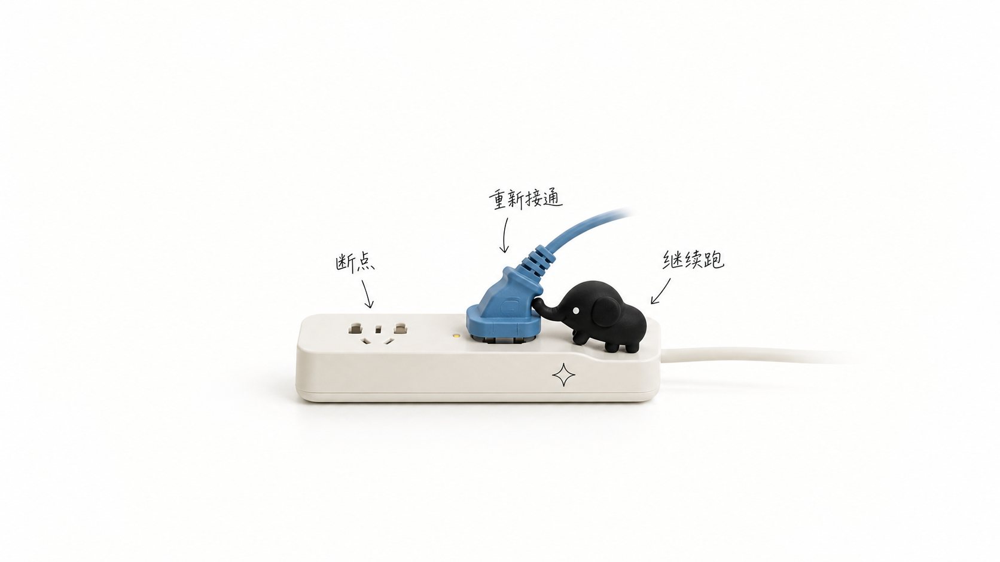

# 小黑象 2.0 测试示例

> 状态：用户已确认收录的测试示例。
> 用途：展示构图、真实物品隐喻、物理动作和 Cover 标题安全区。
> 边界：图中小黑象占比仍大于当前 Skill 的理想值，不作为 `3%-5% / 4%-6%` 尺寸母版；正式生成仍以 [`../references/qa-checklist.md`](../references/qa-checklist.md) 为准。

> 信息密度边界：这些示例主要用于学习留白、角色形体、真实物品质感和单一动作，不是当前正文图的段落级信息密度母版。正式正文图必须先按 [`../references/prompt-template.md`](../references/prompt-template.md) 读取完整段落并选择 D1 / D2 / D3：D1 只用于单一判断，D2 是解释型段落默认档，D3 用于多步骤、多条件、多角色、对比、分支、反馈或明确边界的段落；每个档位都要把对应的信息节点和物件关系画出来。

## 1. 标准模式：重新接通 AI 工作流

- 比例：16:9 横版正文图。
- 核心隐喻：松脱的插头代表断点，重新插入代表工作流恢复运行。
- 核心动作：小黑象用短象鼻推动插头。
- 可复用点：单一主物品、三个短标签、白色摄影棚和大量留白。
- 未作母版的点：小黑象占比偏大，正式图应继续后退镜头并缩小角色。

## 2. Cover 模式：AI 学习路线图 2026

- 比例：21:9 超横版 Cover。
- 主题：《AI 学习路线图 2026：从碎片教程到系统能力》。
- 核心隐喻：松散教程卡片被纳入有节点的环扣路线图，表达从碎片到系统。
- 核心动作：小黑象用短象鼻把最后一张卡片送入整理机构。
- 可复用点：左侧标题安全区、右侧单一实物隐喻、青橙对比、浅色台面与黑象轮廓分离。
- 未作母版的点：小黑象占比偏大，正式 Cover 仍需守住高度 `4%-6%` 的硬上限。

## 使用方法

- 学构图时，先看主物品、物理动作和留白。
- 学 Cover 时，重点看标题安全区与主视觉的分离。
- 生成时不要直接抄图中角色尺寸，必须重新带入 IP lock 和 QA 的占比约束。
